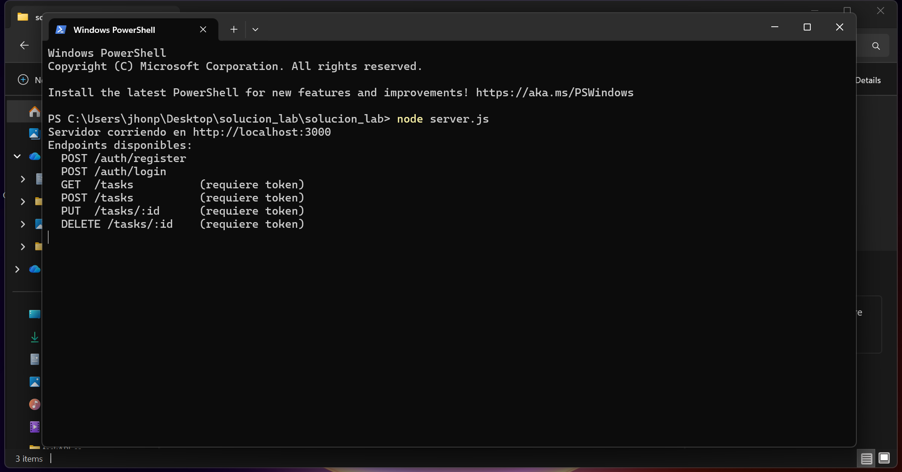
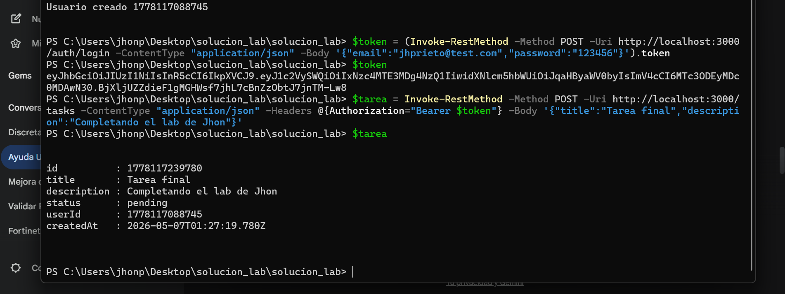
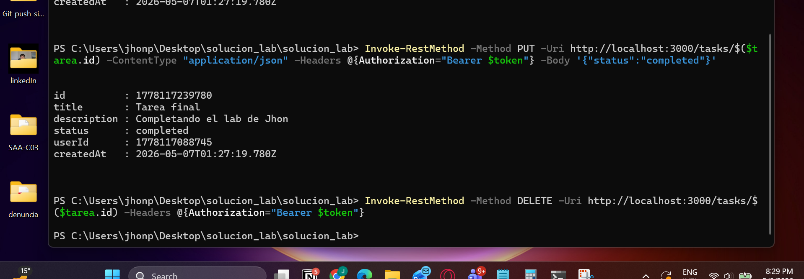
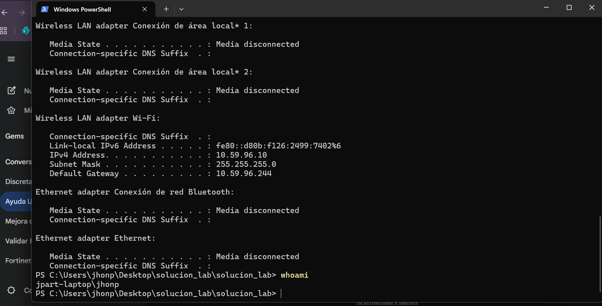
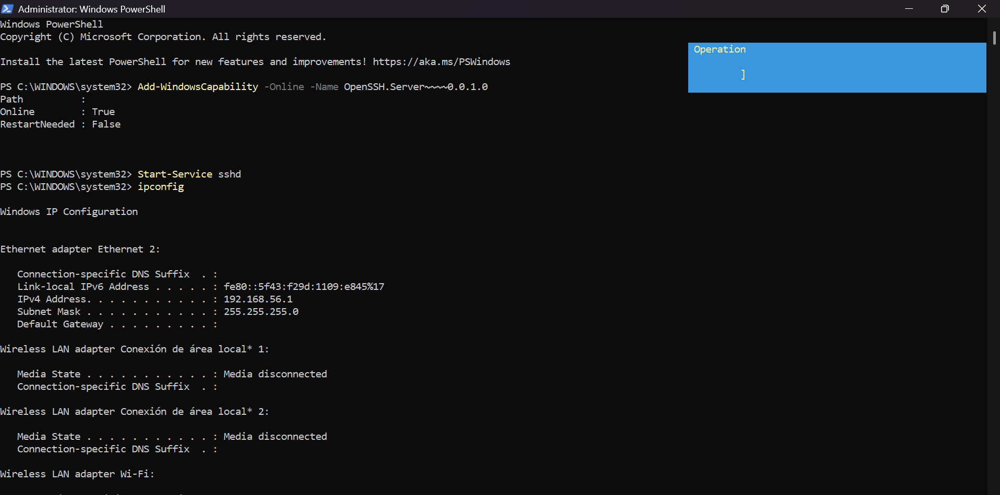
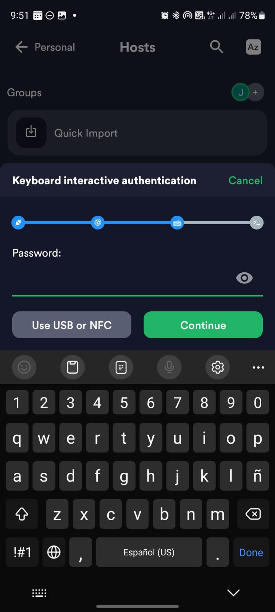
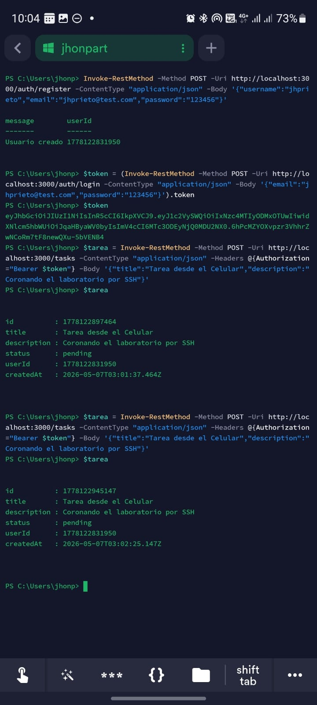

# Curso: Ingeniería de Software II
# Laboratorio: API REST, JWT y Servidor SSH

**Estudiante:** Jhon Edison Prieto Artunduaga  

## Descripción
Este proyecto implementa un servidor local en Node.js que gestiona tareas (To-Do List) utilizando operaciones CRUD. El servidor está protegido mediante JSON Web Tokens (JWT) y se configuró para permitir el acceso remoto y manipulación de datos desde un dispositivo móvil vía protocolo SSH.

---

## 1. Pruebas Locales (Consola PC)

En esta fase se inició el servidor en `localhost:3000` y se comprobó el flujo completo de la API mediante PowerShell.

### Inicialización, Registro y Autenticación
Inicialización del servidor (`node server.js`) y registro de un usuario nuevo mediante un `POST` a `/auth/register` con el correo `jhprieto@test.com`. El sistema responde con la confirmación de usuario creado y su ID.

Inicio de sesión mediante un `POST` a `/auth/login` con las credenciales registradas.

Impresión del Token JWT generado y almacenado en la variable para las validaciones posteriores de las rutas protegidas.

### Operaciones CRUD de Tareas
Creación de una tarea mediante `POST` a `/tasks`, enviando el token en los headers. Se evidencia la creación de la tarea con el título "Tarea final" y estado "pending".

Actualización de la tarea enviando una petición `PUT` a `/tasks/:id` para cambiar exitosamente su estado a "completed".

Eliminación de la tarea utilizando el método `DELETE` apuntando al ID específico de la tarea recién creada.

---

## 2. Configuración del Servidor SSH

Para habilitar la administración remota, se preparó el entorno del sistema operativo Windows.

Instalación del componente `OpenSSH.Server` mediante PowerShell ejecutado en modo Administrador.

Arranque del servicio mediante el comando `Start-Service sshd` y validación de la IP de la máquina local con `ipconfig` para establecer la conexión en red.

---

## 3. Pruebas Remotas vía SSH (Dispositivo Móvil)

Se utilizó la aplicación móvil **Termius** para conectar el teléfono a la consola del PC mediante la red local (Hotspot).

Pantalla de autenticación interactiva (Keyboard interactive authentication) ingresando exitosamente las credenciales del host en Termius.

Ejecución de operaciones desde la terminal del celular. Se realiza un nuevo registro y login remoto obteniendo un nuevo token JWT válido. Posteriormente, se crea una tarea remota mediante un `POST` con el título "Tarea desde el Celular" y descripción "Coronando el laboratorio por SSH".

---

**Conclusión:** Se comprobó la total funcionalidad de la API REST local, la robustez de la autenticación por JWT y se superó el reto de conectividad administrando el sistema de forma remota a través de un túnel SSH desde un terminal móvil.
