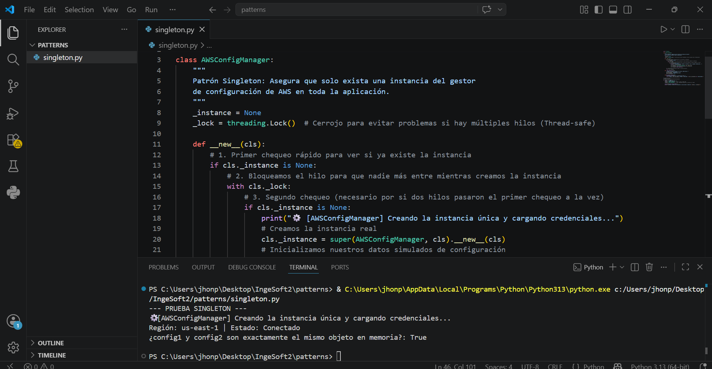
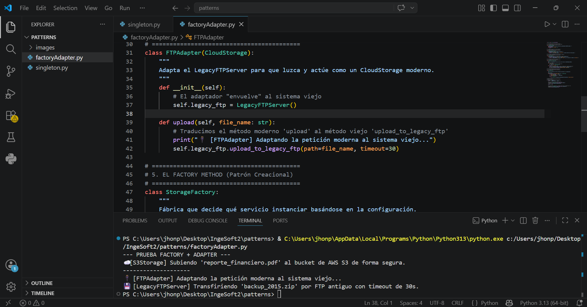
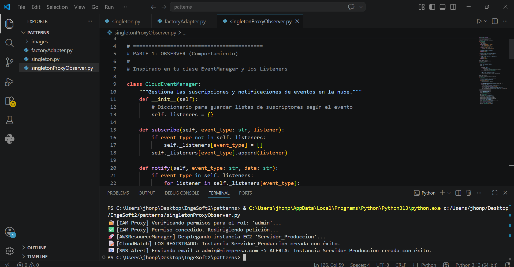

# ☁️ Entrega: Patrones de Diseño aplicados a Entornos Cloud (AWS)

**Hola, profesor.** Para esta entrega, decidí orientar todos los ejercicios hacia el mundo del **Cloud Computing** (específicamente tomando inspiración en servicios de AWS). La razón de esto es que es un área que me gusta mucho y sentí que aterrizar los patrones de diseño en problemas reales de infraestructura me ayudaría a entender mucho mejor su utilidad. 

En lugar de usar ejemplos abstractos, implementé casos de uso prácticos donde los patrones resuelven problemas de escalabilidad, compatibilidad y seguridad en la nube.

---

## 1. Nivel 1: Patrón Creacional (Singleton)

**¿Qué hice aquí?**
Implementé un **Gestor de Configuración de AWS** (`AWSConfigManager`). 

**¿Para qué sirve y qué problema resuelve?**
En la nube, leer credenciales o variables de entorno (como el *Access Key*) consume recursos. Si tengo varios componentes que necesitan conectarse a AWS, no es eficiente que cada uno cargue la configuración por separado. 

El patrón **Singleton** asegura que la primera vez que se piden las credenciales, estas se cargan en memoria y se crea una instancia única. Si otro componente vuelve a pedirlas, el Singleton simplemente le devuelve la misma información que ya tiene guardada, ahorrando memoria. Además, incluí un "bloqueo" (`threading.Lock`) para que el sistema sea seguro si se usan varios hilos a la vez.

---

## 2. Nivel 2: Patrón Creacional + Estructural (Factory Method + Adapter)

**¿Qué hice aquí?**
Creé un sistema de almacenamiento híbrido (`StorageFactory` y `FTPAdapter`) que permite subir archivos a la nube moderna o a servidores antiguos usando el mismo comando.

**¿Para qué sirve y qué problema resuelve?**
Imaginemos que nuestra app guarda cosas en **AWS S3**, pero un cliente nos obliga a usar también un **Servidor FTP antiguo** con comandos muy diferentes. 
* **El Adapter (Estructural):** "Envuelve" el código del servidor viejo para que se comporte como uno moderno. Actúa como un traductor: nosotros usamos `.upload()` y él lo traduce internamente a los comandos raros del FTP.
* **El Factory Method (Creacional):** La Fábrica decide qué objeto darnos según la configuración (S3 o FTP). 

**Resultado:** La aplicación principal no tiene que saber nada de servidores viejos; solo pide un servicio y sube el archivo de forma estandarizada.

---

## 3. Nivel 3: Creacional + Estructural + Comportamiento (Singleton + Proxy + Observer)

**¿Qué hice aquí?**
Este es el sistema más robusto: un **Gestor Seguro de Despliegue de Recursos**. Simula cómo se crea un servidor en AWS con capas de seguridad y alertas automáticas.

**¿Para qué sirve y cómo se combinan?**
Este flujo imita una arquitectura profesional:
1. **Singleton (El Motor - `AWSResourceManager`):** Es la clase única que gestiona la creación de servidores para mantener un orden centralizado.
2. **Proxy (El Guardia - `IAMSecurityProxy`):** Intercepta la petición antes de que llegue al Singleton. Revisa si el usuario tiene permiso de "admin" (IAM). Si no tiene permiso, bloquea la acción. Es nuestra capa de seguridad estructural.
3. **Observer (El Megáfono - `CloudEventManager`):** Cuando ocurre algo importante (un servidor se crea con éxito o alguien intenta entrar sin permiso), el Observer avisa automáticamente a los "suscriptores": un sistema de Logs y un sistema de alertas por correo.

---

### Conclusión personal
Entender los patrones de forma aislada es la base, pero el verdadero valor está en **combinarlos**. En este proyecto, logré separar la creación (Singleton), la seguridad (Proxy) y la comunicación (Observer) en piezas independientes que trabajan juntas. Esto hace que el código sea mucho más fácil de escalar y mantener en un entorno real.