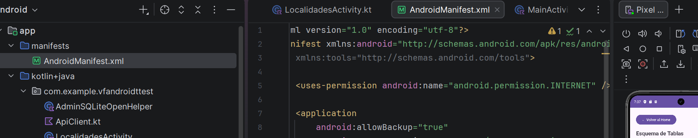
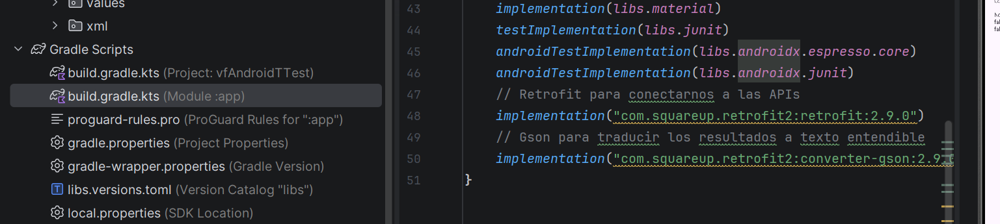
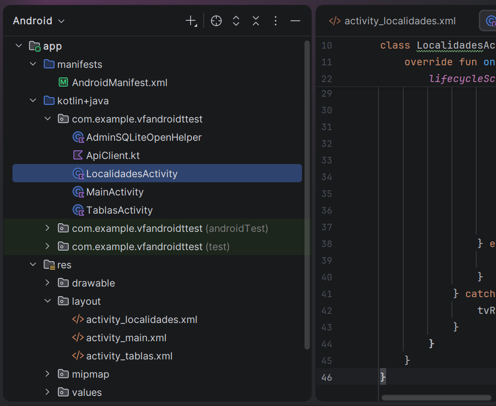
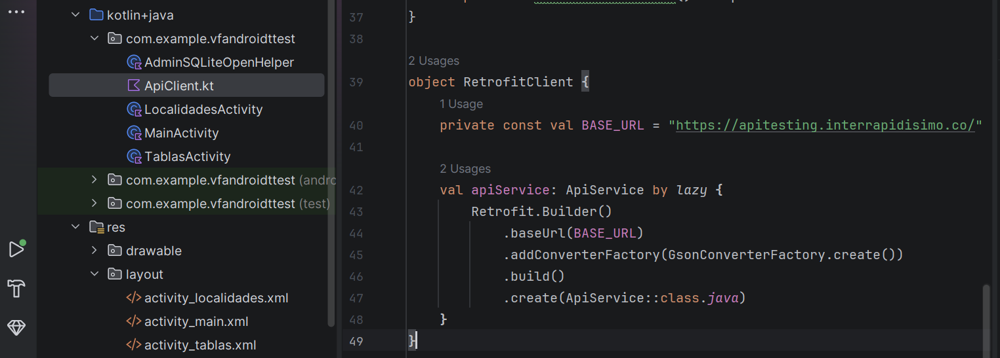
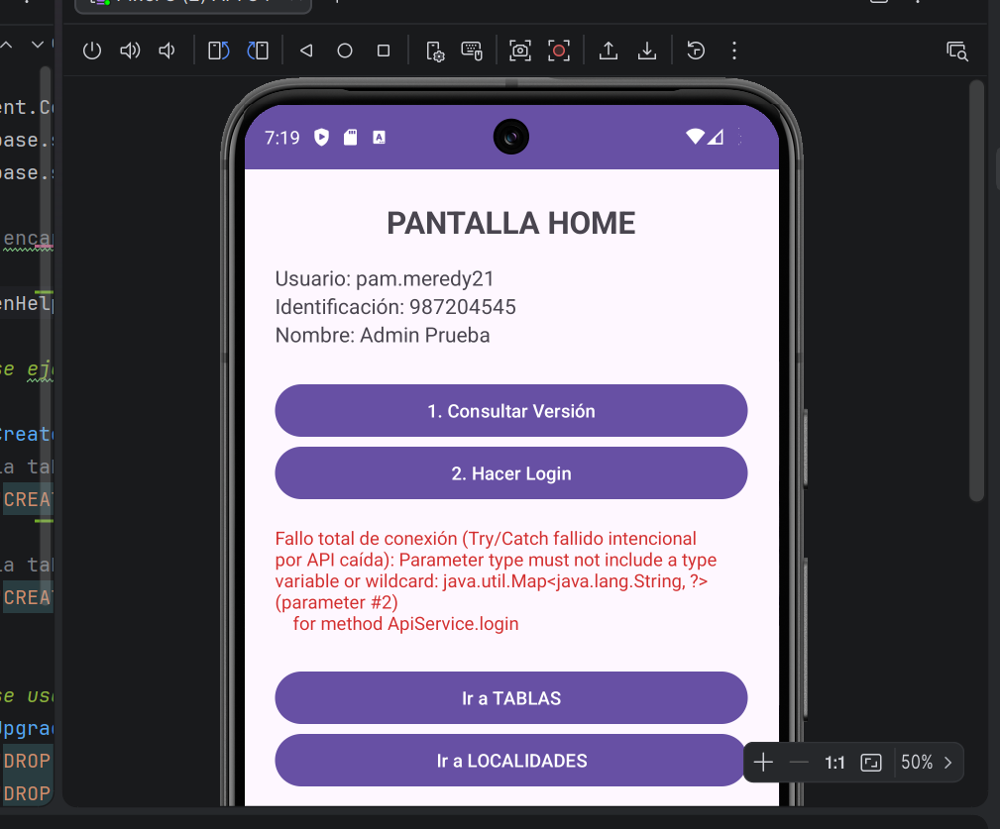
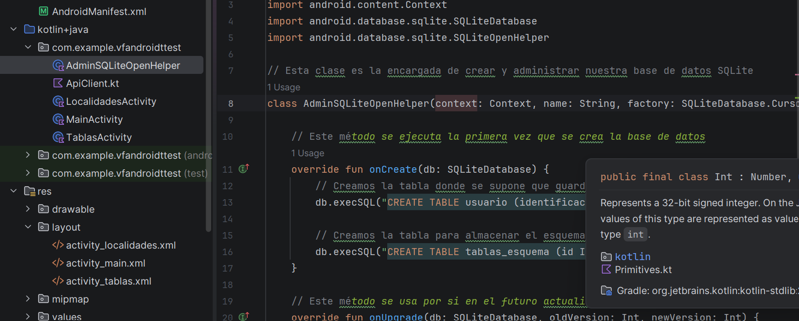
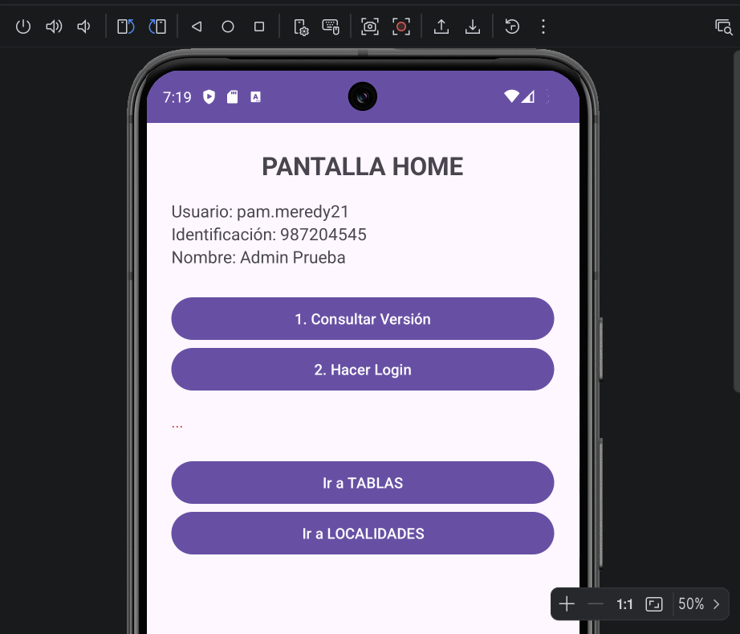
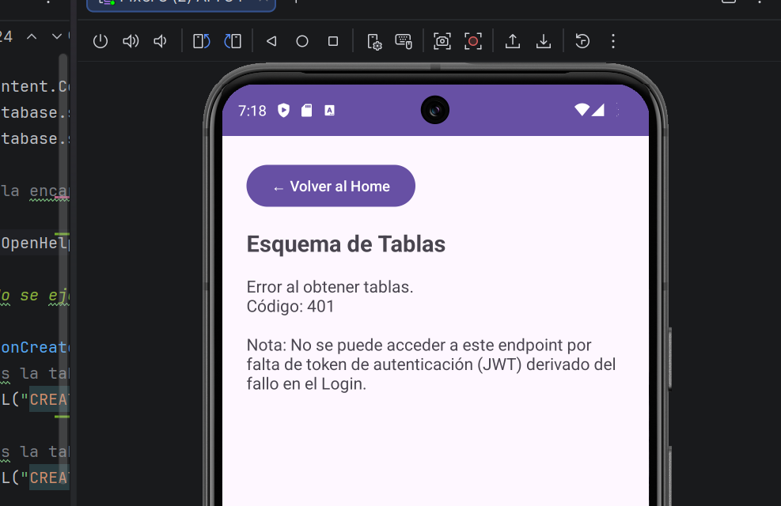
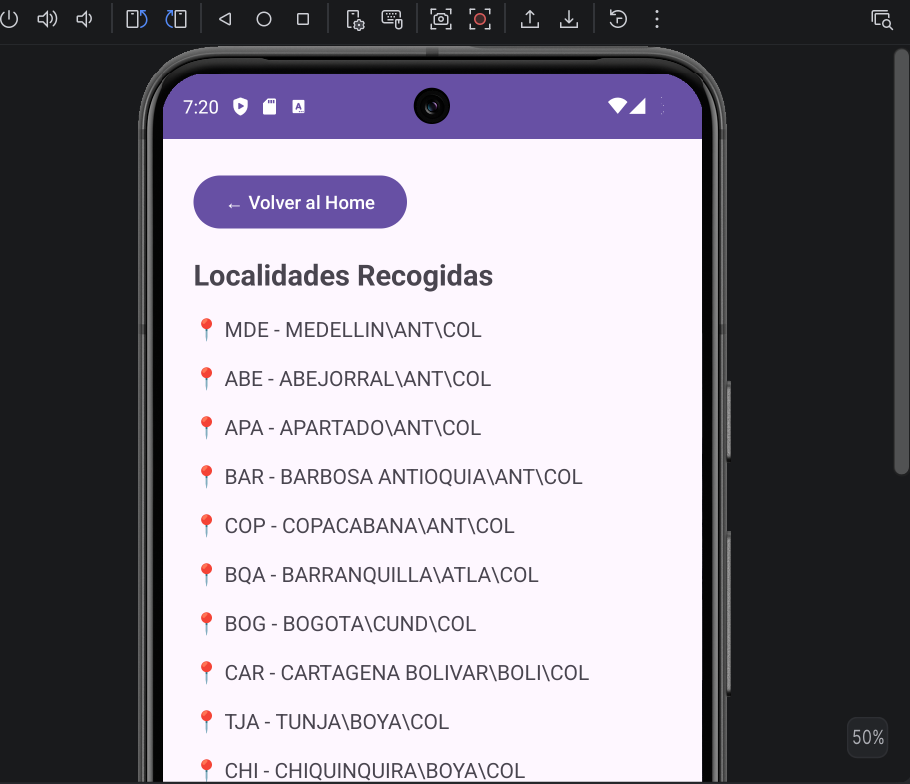

# Prueba Técnica Android - App de Consumo de APIs y SQLite 📱

Este proyecto es la solución a la prueba técnica de desarrollo Android nativo utilizando **Kotlin**. La aplicación está diseñada siguiendo los principios recomendados de estructuración en tres capas (Seguridad, Datos y Presentación), consumiendo APIs RESTful y gestionando almacenamiento local mediante SQLite.

## 🛠 Tecnologías y Herramientas Utilizadas
* **Lenguaje:** Kotlin
* **IDE:** Android Studio
* **Peticiones HTTP:** Retrofit2 + Gson (Para serialización/deserialización)
* **Asincronismo:** Corrutinas (Coroutines) y `lifecycleScope`
* **Base de Datos:** SQLite Nativo (`SQLiteOpenHelper`)
* **Arquitectura base:** MVC adaptado a las 3 capas solicitadas.

---

## 🚀 Pasos de Implementación y Arquitectura

### 1. Configuración Inicial
Lo primero fue configurar los permisos de la aplicación para poder salir a internet. Se modificó el Manifest y se implementaron las dependencias de Retrofit en el entorno de Gradle.

### 2. Capa de Seguridad (Consumo de APIs)
Se creó un cliente API (`ApiClient.kt`) para centralizar los endpoints proporcionados en la prueba. 

Para cumplir con el requisito de manejo de excepciones, se implementaron bloques **Try/Catch** en todas las llamadas de red usando Corrutinas, asegurando que la aplicación no bloquee el hilo principal (Main Thread). 

* **Control de Versiones:** Se consume el endpoint de parámetros. La lógica cruza la versión local de la app con la versión retornada por el API e indica en pantalla si es superior, inferior o si está actualizada.
* **Autenticación (Login):** Se envían los Headers y el Body exactos especificados. Al obtener un código HTTP diferente a 200 (debido a la configuración actual del endpoint de prueba), la aplicación captura este escenario y alerta al usuario mediante la UI y un `Toast`, evitando el colapso (crash) de la app.

### 3. Capa de Datos (SQLite)
Se diseñó la clase `AdminSQLiteOpenHelper` extendiendo de `SQLiteOpenHelper`. Esta base de datos (`PruebaTecnicaDB`) se instancia al iniciar la aplicación, construyendo la estructura y las tablas necesarias solicitadas: una para el `usuario` y otra para el `esquema de tablas`.

### 4. Capa de Presentación (UI/UX)
Se desarrollaron 3 actividades (Activities) principales, navegables mediante `Intents`:

* **Home:** Contiene los datos del perfil (simulados por el fallo previo y esperado del login) y el acceso a las validaciones de seguridad (Versión y Login).
* **Tablas:** Intenta consumir el endpoint de Esquemas. Al depender de un token JWT que no fue provisto en el paso de Login (debido al error 401 originado allí), se maneja el error de "No Autorizado" informando claramente al usuario en pantalla para mantener una buena experiencia de usuario.
* **Localidades:** Consume exitosamente el endpoint de parámetros de localidades, mostrando en un `ScrollView` la lista renderizada de la `AbreviacionCiudad` y el `NombreCompleto` obtenida de la red.

---

## 🚧 Retos Afrontados y Soluciones

Durante el desarrollo se presentaron los siguientes escenarios que permitieron aplicar buenas prácticas de ingeniería de software:

1. **Estado de los Endpoints (Errores 401 en Cadena):** * **Reto:** El endpoint del Login no devolvía el token JWT esperado, lo que en cadena rompía la solicitud de la pantalla de Tablas (retornando un HTTP 401 - Unauthorized). 
   * **Solución:** En lugar de forzar un flujo ideal inexistente, utilicé la respuesta de Retrofit (`!response.isSuccessful`) para atrapar la excepción. Documenté el error en la interfaz de forma controlada indicando el motivo exacto del fallo (Falta de token), cumpliendo el requisito de "Manejo de errores de consumo de API Rest".
2. **Asincronismo:** * **Reto:** Android prohíbe realizar peticiones de red en el hilo principal de la interfaz de usuario. 
   * **Solución:** Implementé Kotlin Coroutines (`lifecycleScope.launch`) para ejecutar el consumo de todas las APIs de manera asíncrona, manteniendo la interfaz fluida en todo momento.
3. **Estructura del Proyecto:** * **Reto:** Diferenciar correctamente los directorios de pruebas (`test` o `androidTest`) del directorio principal de ejecución. 
   * **Solución:** Se mantuvo una jerarquía limpia donde los clientes de API, los Helpers de SQLite y las Activities conviven en el paquete principal, permitiendo una correcta compilación.
