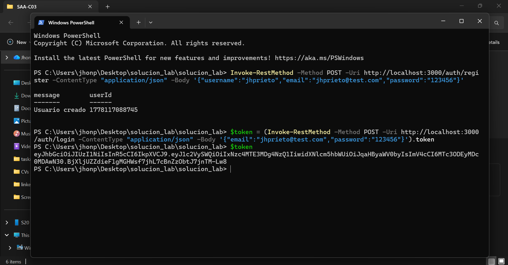
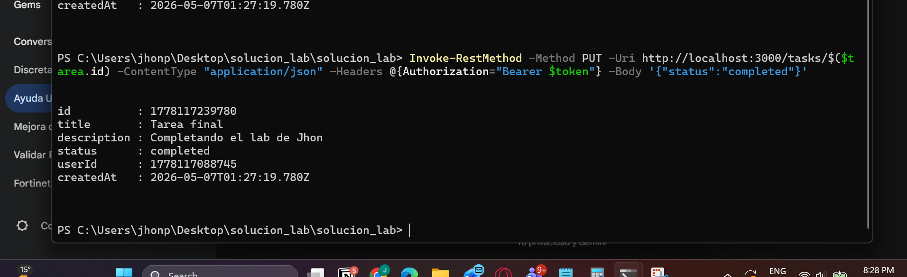
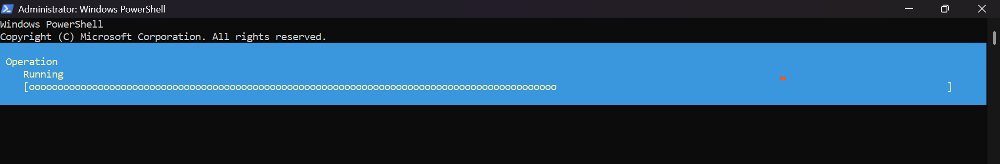

# Curso: Ingeniería de Software II
# Laboratorio: Implementación de API REST con JWT y Acceso Remoto vía SSH

**Estudiante:** Jhon Edison Prieto Artunduaga  
**Fecha:** 6 de mayo de 2024

## Descripción del Proyecto
Este laboratorio consiste en el desarrollo y despliegue de un servidor de tareas (To-Do List) utilizando **Node.js**. El servidor implementa autenticación mediante **JSON Web Tokens (JWT)** y permite operaciones CRUD (Crear, Leer, Actualizar, Eliminar) protegidas. Además, se configuró un servidor **OpenSSH** en el host para permitir el consumo de la API desde dispositivos externos en la misma red local.

---

## 1. Pruebas Locales (PowerShell en PC)

En esta fase inicial, se puso en marcha el servidor y se validaron los endpoints de autenticación y gestión de tareas de manera local.

### Registro e Inicio de Sesión
Se realizó el registro de un nuevo usuario y se obtuvo el token de acceso necesario para las peticiones protegidas.

- **Registro de usuario:**
  

- **Obtención y validación del Token JWT:**
  
  

### Gestión de Tareas (CRUD)
Se validó que el acceso a las tareas estuviera restringido sin el token y se realizaron las operaciones de creación, edición y eliminación.

- **Listado de tareas (con y sin autorización):**
  

- **Flujo CRUD completo (POST, PUT, DELETE):**
  

---

## 2. Configuración del Servidor SSH

Para permitir el acceso remoto, se habilitaron las capacidades de servidor SSH de Windows y se configuró el Firewall para permitir tráfico por el puerto 22.

- **Instalación de OpenSSH Server:**
  

- **Inicio y verificación del servicio SSH:**
  

---

## 3. Pruebas Remotas vía SSH (Dispositivo Móvil)

Utilizando la aplicación **Termius** desde un teléfono celular conectado a la misma red local (vía Hotspot), se estableció una sesión SSH para interactuar con la consola del servidor de forma remota.

### Autenticación desde el Móvil
Debido a que el servidor almacena los datos en memoria, se procedió a realizar nuevamente el registro y login para generar un nuevo token de sesión desde la terminal móvil.

- **Login y obtención de Token por SSH:**
  

### Operaciones CRUD Remotas
Se ejecutaron comandos de PowerShell a través del túnel SSH para crear y listar tareas, demostrando que el servidor es accesible y funcional desde otros nodos de la red local.

- **Creación y Verificación de Tarea:**
  

---

## Conclusiones
1. **Seguridad:** Se implementó correctamente la lógica de JWT, asegurando que solo usuarios autenticados puedan manipular sus tareas.
2. **Conectividad:** Se logró establecer una conexión remota exitosa mediante SSH superando las restricciones de red local.
3. **Interoperabilidad:** Se validó el consumo de la API mediante `Invoke-RestMethod` tanto en entorno local como remoto.